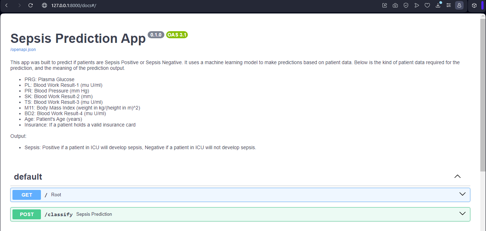
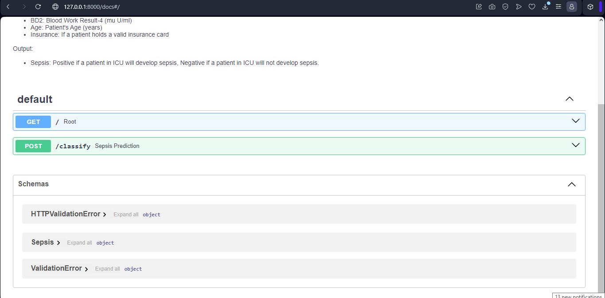

# SEPSIS PREDICTION ANALYSIS AND API CREATION

## Technologies

## Project Description

Welcome to the **Sepsis Prediction and API Creation** project. This project aims to leverage machine learning to predict whether patients will develop sepsis using their physiological data.

Sepsis is a critical medical condition characterized by the body's extreme response to infection, often leading to severe tissue damage, multiple organ failure, and even death. Each year, approximately 30 million individuals worldwide develop sepsis, with a staggering one-fifth of them succumbing to the disease. Detecting sepsis early and initiating immediate treatment is crucial for saving lives and improving patient outcomes.

Machine Learning models will be trained to make accurate sepsis predictions, and the best performing model will be used to make predictions on the test dataset. This model will then be used to build a FastAPI, which will be containerized in a docker and hosted on HuggingFace. This will make the model publicly available, and can be used with or without technical knowledge.

## Notebook Preview

Below is a preview showcasing some features of the notebook:

    

        
Sepsis Distribution

        
    

    

        
Age Distribution

        
        

    

        
Test Prediction

        
        

## FastAPI Setup

Install the required packages to be able to run the evaluation locally.

You need to have [`Python 3`](https://www.python.org/) on your system (**Python version 3.11 was used**). Then you can clone this repo and being at the repo's `root :: repository_name> ...`  follow the steps below:

- Windows:
        
        python -m venv venv; venv\Scripts\activate; python -m pip install -q --upgrade pip; python -m pip install -qr requirements.txt  

- Linux & MacOs:
        
        python3 -m venv venv; source venv/bin/activate; python -m pip install -q --upgrade pip; python -m pip install -qr requirements.txt  

The two long command-lines have the same structure. They pipe multiple commands using the symbol ` ; ` but you can manually execute them one after the other.

1. **Create the Python's virtual environment** that isolates the required libraries of the project to avoid conflicts;
2. **Activate the Python's virtual environment** so that the Python kernel & libraries will be those of the isolated environment;
3. **Upgrade Pip, the installed libraries/packages manager** to have the up-to-date version that will work correctly;
4. **Install the required libraries/packages** listed in the `requirements.txt` file so that they can be imported into the python script and notebook without any issue.

**NB:** For MacOs users, please install `Xcode` if you have an issue.

## Run FastAPI

- Run the API (being at the repository root):
        
  FastAPI:
    
    - Main

          uvicorn src.main:app --reload 

    <!-- - Sepsis prediction

          uvicorn src.main:app --reload  -->

  - Go to your browser at the following address, to explore the API's documentation :
        
      http://127.0.0.1:8000/docs

## FastAPI Preview

Below is a preview showcasing some features of the FastAPI:

    

        
FastAPI Top

        
    

    

        
FastAPI Bottom

        
        

    

        
FastAPI Prediction

        
        

## Resources
Here are some ressources you would read to have a good understanding of FastAPI :
- [Tutorial - User Guide](https://fastapi.tiangolo.com/tutorial/)
- [Video - Building a Machine Learning API in 15 Minutes ](https://youtu.be/C82lT9cWQiA)
- [FastAPI for Machine Learning: Live coding an ML web application](https://www.youtube.com/watch?v=_BZGtifh_gw)
- [Video - Deploy ML models with FastAPI, Docker, and Heroku ](https://www.youtube.com/watch?v=h5wLuVDr0oc)
- [FastAPI Tutorial Series](https://www.youtube.com/watch?v=tKL6wEqbyNs&list=PLShTCj6cbon9gK9AbDSxZbas1F6b6C_Mx)
- [Http status codes](https://www.linkedin.com/feed/update/urn:li:activity:7017027658400063488?utm_source=share&utm_medium=member_desktop)

## Author

| Name | Profile | Twitter | Contact | Article | Deployment |
| ---- | ------- | ------- | ------- | ------- | ---------- |
| Chidiebere David Ogbonna | [LinkedIn](https://www.linkedin.com/in/chidieberedavidogbonna/) | [iameberedavid](https://twitter.com/iameberedavid) | eberedavid326@gmail.com | [Medium](https://eberedavid.medium.com/sepsis-prediction-analysis-and-api-creation-8dc92718760a) | [HuggingFace](https://huggingface.co/spaces/iameberedavid/Sepsis_Prediction_API_Docker_Deployment) |

## Acknowledgments

I would like to express my gratitude to the [Azubi Africa Data Analyst Program](https://www.azubiafrica.org/data-analytics) for their support and for offering valuable projects as part of this program. Not forgeting my scrum masters on this project [Rachel Appiah-Kubi](https://www.linkedin.com/in/racheal-appiah-kubi/) & [Emmanuel Koupoh](https://github.com/eaedk)

## License

This project is licensed under the MIT License - see the [LICENSE.md](LICENSE.md) file for details.